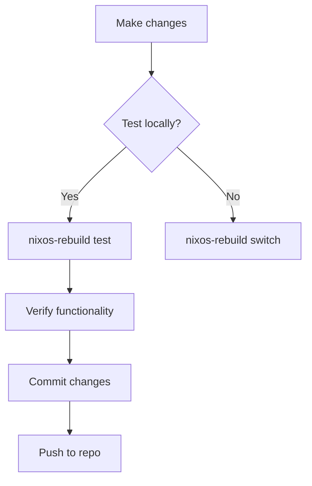

# NixOS Configuration

[](https://nixos.org)
[](https://nixos.org)
[](https://nixos.wiki/wiki/Flakes)

This repository contains my personal NixOS configuration files for system and service management. Configurations are fully declarative and managed via Nix Flakes.

## Hosts

### Kairos (Primary Desktop)
Primary workstation for daily use, development, and gaming. With a customized Plasma desktop environment.

### Echo (Home Server)
Central homelab node running 24/7 with high uptime. Provides centralized storage, self-hosted services, and automated backups. Operates as a low-power HTPC capable of directing input to TVs and handling light gaming. Hosts containerized services while maintaining remote accessibility.

### Sky (Public Server)

A publicly accessible server hosting self-managed services like Jellyfin and other web applications.

## Deploying the config to a server

This is the canonical guide for deploying this repository to a machine. It is split into a general, machine-agnostic section and a VPS-specific section. Follow the checklist before any remote work.

### Assumptions and safety

* The flake defines a `nixosConfigurations.<hostname>` output for the host you want to deploy.
* Secrets are managed with agenix and age public keys are in `secrets/secrets.nix` or equivalent.
* Keep private keys off the repo.
* When working on remote machines, ensure you have a rescue/console path in case networking breaks.

### Quick checklist before touching a machine

1. Confirm the host entry exists in the flake outputs and the hostname matches the target.
2. Update flake inputs locally if you want the latest packages: `nix flake update`. Commit the updated `flake.lock` if reproducible installs are desired.
3. Ensure secrets are present locally and encrypted with agenix. Do not commit plaintext secrets.
4. Have an SSH key usable on the target. Keep a root or console access backup.
5. Back up any critical data on the target before doing major system changes.

### Common commands reference

Clone the repo on the target:

```bash
# HTTPS
sudo nix-shell -p git --run "git clone https://github.com/exil0867/nixcfg /etc/nixos"

# SSH
sudo nix-shell -p git --run "git clone git@github.com:exil0867/nixcfg /etc/nixos"
```

Apply configuration for the current machine:

```bash
sudo nixos-rebuild switch --flake path:.#$(hostname)
# or explicitly:
sudo nixos-rebuild switch --flake path:.#kairos
```

Fresh install from live medium:

```bash
sudo nixos-install --flake path:/mnt/etc/nixos/flake#<hostname>
```

Copying encrypted secrets securely:

```bash
tar -czf - -C /home/you/nixcfg secrets \
  | ssh nixos@TARGET_IP "sudo tar -xzf - -C /mnt/etc/nixos/flake/"
```

Fixing git safe.directory issues when running as root:

```bash
sudo git config --global --add safe.directory /home/<user>/Develop/nixcfg
```

### Machine-agnostic workflow

1. Prepare the repo locally:

   * Keep `flake.lock` up to date.
   * Ensure `hosts/<hostname>` exists and `nixosConfigurations.<hostname>` is defined.
   * Encrypt secrets with agenix; store only public keys in `secrets/secrets.nix`.

2. Make secrets available on the target:

   * Preferred: send secrets temporarily with a secure tar+ssh pipeline.
   * Alternative: scp/rsync to a user-owned path, then move/extract with sudo.

3. Ensure repo ownership and permissions are correct on the target.

4. Run the build:

   * Existing host: `cd /path/to/repo && sudo nixos-rebuild switch --flake path:.#<hostname>`
   * Fresh install: mount root at `/mnt`, place repo at `/mnt/etc/nixos/flake`, then `sudo nixos-install --flake path:/mnt/etc/nixos/flake#<hostname>`

5. Post-install:

   * Reboot if needed.
   * Verify services/logs: `journalctl -b -p err` and `systemctl status <service>`.
   * Edit configs and rebuild: `sudo nano /etc/nixos/flake/hosts/<hostname>/...` then `sudo nixos-rebuild switch --flake path:/etc/nixos/flake#<hostname>`.

### VPS-specific tips

* Avoid destructive restarts without remote console.
* Use tar+ssh for installing repo into `/mnt/etc/nixos/flake` on VPS.
* You can work in `/home/<user>/Develop/nixcfg` instead, but fix `safe.directory` if git complains.
* When transferring secrets, do not leave plaintext in home. Example safe transfer:

```bash
tar -czf - -C /home/you/nixcfg secrets \
  | ssh nixos@IP "sudo tar -xzf - -C /mnt/etc/nixos/flake/ && sudo chown -R root:root /mnt/etc/nixos/flake/secrets && sudo chmod -R 600 /mnt/etc/nixos/flake/secrets/*"
```

### Secrets and agenix workflow

* Keep private keys local; only public keys in `secrets/secrets.nix`.
* Encrypt files before committing:

```bash
agenix -e secrets/my-secret-file
git add secrets/my-secret-file.age
```

* On target, encrypted files and flake logic are enough to write them at build time.
* Rekey/rotate keys: `agenix --rekey` locally and update `secrets.nix`.

### Troubleshooting and common gotchas

* Repository unsafe when run as root: add safe.directory or run from root-owned path.
* Secrets unreadable: ensure copied under `/mnt/etc/nixos/flake/secrets`.
* `nixos-install` flake errors: verify path and hostname match; debug with `nixos-rebuild switch`.
* Flake inputs differ on installer vs host: keep `flake.lock` committed.
* Service fails: `journalctl -u <service> -b` and rollback if needed.

### Minimal example session

```bash
# Local prep
git clone git@github.com:exil0867/nixcfg
cd nixcfg
nix flake update
agenix -e secrets/deluge/auth
git add secrets/*.age
git commit -m "update secrets and flake"

# Push secrets to remote installer
tar -czf - -C "$(pwd)" secrets \
  | ssh nixos@37.120.187.211 "sudo tar -xzf - -C /mnt/etc/nixos/flake/"

# On remote live installer
sudo nixos-install --flake path:/mnt/etc/nixos/flake#sky

# After reboot, on host
cd /home/exil0681/Develop/nixcfg
sudo git config --global --add safe.directory /home/exil0681/Develop/nixcfg
sudo nixos-rebuild switch --flake path:.#sky
```

### Final notes

* Never commit raw secrets; always use agenix.
* Prefer ephemeral secret transfer during install.
* Keep `flake.lock` under version control.
* Test locally with `nixos-rebuild build` or `nixos-rebuild test` before production.

---

## Regular Maintenance

* Apply configuration changes:

```bash
sudo nixos-rebuild switch --flake path:.#$(hostname)
```

* Update flake inputs:

```bash
nix flake update
```

## Update Workflow



## Security

* Secrets management via `agenix`
* Automatic service-specific firewall rules
* Full disk encryption by default
* SSH key-based remote access

## Adding New Hosts

1. Create host directory:

```bash
mkdir -p hosts/new-host
```

2. Generate hardware configuration:

```bash
nixos-generate-config --dir hosts/new-host
```

3. Add to flake outputs:

```nix
nixosConfigurations.new-host = lib.nixosSystem { /* configuration */ };
```

## Troubleshooting

* Rollback to previous configuration:

```bash
sudo nixos-rebuild switch --rollback
```

* Investigate service failures:

```bash
journalctl -u failed-service -b
```