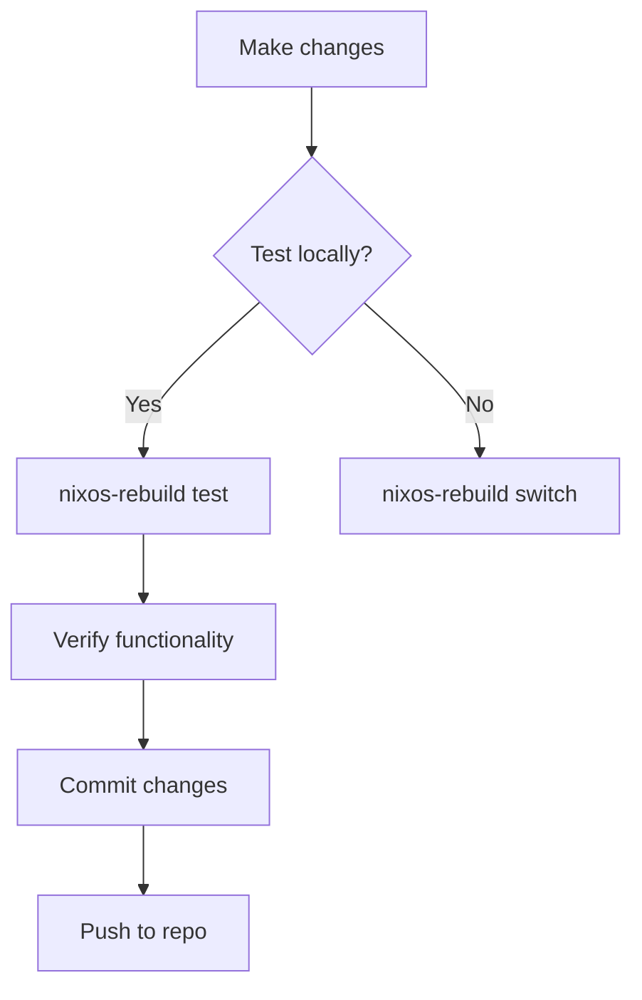

# NixOS Configuration

[](https://nixos.org)
[](https://nixos.org)
[](https://nixos.wiki/wiki/Flakes)

This repository contains my personal NixOS configuration files for system and service management. Configurations are fully declarative and managed via Nix Flakes.

## Hosts

### Kairos (Primary Desktop)
Primary workstation for daily use, development, and gaming. With a customized Plasma desktop environment.

### Echo (Home Server)
Central homelab node running 24/7 with high uptime. Provides centralized storage, self-hosted services, and automated backups. Operates as a low-power HTPC capable of directing input to TVs and handling light gaming. Hosts containerized services while maintaining remote accessibility.

### Sky (Public Server)

A publicly accessible server hosting self-managed services like Jellyfin and other web applications.
```bash
sudo nix-shell -p git --run "git clone https://github.com/your/repo /etc/nixos"
```
2. Build system configuration (Kairos example):
```bash
sudo nixos-rebuild switch --flake path:/etc/nixos#kairos
```

### Regular Maintenance
- Apply configuration changes:
```bash
sudo nixos-rebuild switch --flake path:.#$(hostname)
```
- Update flake inputs:
```bash
nix flake update
```

## Update Workflow


## Security
- Secrets management via `agenix`
- Automatic service-specific firewall rules
- Full disk encryption by default
- SSH key-based remote access

## Adding New Hosts
1. Create host directory:
```bash
mkdir -p hosts/new-host
```
2. Generate hardware configuration:
```bash
nixos-generate-config --dir hosts/new-host
```
3. Add to flake outputs:
```nix
nixosConfigurations.new-host = lib.nixosSystem { /* configuration */ };
```

## Troubleshooting
- Rollback to previous configuration:
```bash
sudo nixos-rebuild switch --rollback
```
- Investigate service failures:
```bash
journalctl -u failed-service -b
```