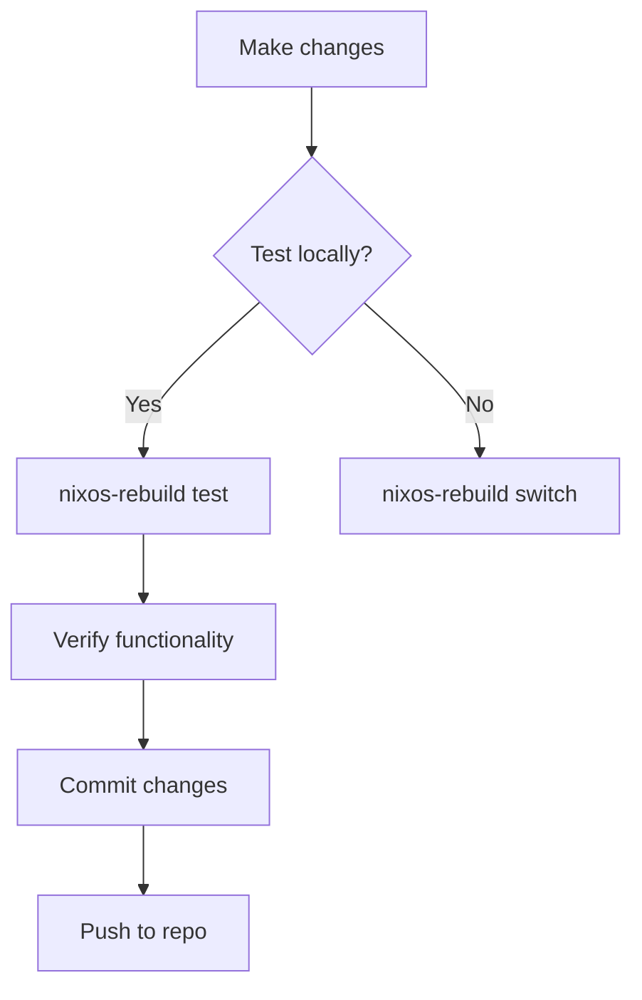

# NixOS Configuration

[](https://nixos.org)
[](https://nixos.org)
[](https://nixos.wiki/wiki/Flakes)

This repository contains my personal NixOS configuration files.

The migration of my devices and home server to NixOS is still in progress. The goal of this project is to rewrite everything I run in a declarative way.

## System Roles

### 🖥️ Kairos (Primary Desktop)
- **Purpose**: Daily driver workstation
- **Features**:
  - Gaming/Streaming setup
  - NVIDIA GPU acceleration
  - Virtualization (QEMU/Docker)
  - Plasma desktop customization

### 🏠 Echo (Home Server)
- **Purpose**: Lightweight server & backup
- **Features**:
  - Remote access
  - Automated storage mounting
  - Service containerization
  - Low-power operation

## 🚀 Quick Start

### Initial Deployment
1. Clone repo to target machine:
   ```bash
   sudo nix-shell -p git --run "git clone https://github.com/your/repo /etc/nixos"
   ```
2. Build system (Kairos example):
   ```bash
   sudo nixos-rebuild switch --flake path:/etc/nixos#kairos
   ```

### Regular Usage
- Apply configuration changes:
  ```bash
  sudo nixos-rebuild switch --flake path:.#$(hostname)
  ```
- Update flake inputs:
  ```bash
  nix flake update
  ```

## 🔄 Update Workflow



## 🔒 Security Practices
- Secrets managed through `agenix`
- Automatic firewall rules for services
- Encrypted root partition by default
- Remote access via SSH keys

## ➕ Adding New Machines
1. Create host directory:
   ```bash
   mkdir -p hosts/new-machine
   ```
2. Generate hardware config:
   ```bash
   nixos-generate-config --dir hosts/new-machine
   ```
3. Add to flake outputs:
   ```nix
   nixosConfigurations.new-machine = lib.nixosSystem { /* config */ };
   ```

## ⚠️ Troubleshooting
- Roll back to previous generation:
  ```bash
  sudo nixos-rebuild switch --rollback
  ```
- Inspect failed service:
  ```bash
  journalctl -u failed-service -b
  ```